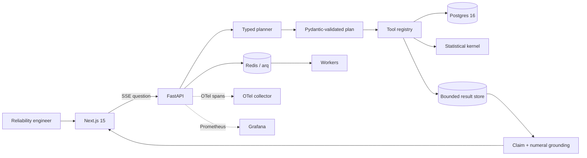

# Hardware Reliability Insights Agent

HRIA is an evidence-first analysis application for synthetic hardware qualification data. A reliability engineer asks a question in ordinary language; a constrained planner selects typed tools, while deterministic code—not the language model—computes estimates, uncertainty, tests, and charts. Every numerical claim carries a result ID and evidence path that resolves to the method, population, exclusions, caveats, and parameterized SQL shown in the UI.

## Answer and evidence drawer

The Ask screen streams the validated plan, tool lifecycle, and claim-validation events over SSE. In the seeded demo, “Which lot of PN-4471 is anomalous?” identifies `LOT-0042`: 65 failures among 132 units, an observed proportion of 49.2%, and a Benjamini-Hochberg-adjusted q-value of `1.943e-04`. Opening the evidence drawer shows the 633-row cohort query, filters, zero excluded canonical rows, both caveats, and the complete typed result.

The interface was exercised end to end against the local Postgres seed. A release screenshot is deliberately not committed as proof of deployment: it should be captured from the same build and dataset version named in a release report, not from an unrelated mock.

## Grafana dashboard

[`deploy/grafana/hria-dashboard.json`](deploy/grafana/hria-dashboard.json) is a provisionable dashboard with API and tool latency, ready queue depth, abstentions, ungrounded-number count, tokens per question, and eval pass rate by family.

No AWS environment was provisioned while building this repository, so there is no fabricated “live Grafana” screenshot. The release gate is: apply the infrastructure, install the chart, drive queued work until KEDA scales the worker, capture the dashboard with the Git SHA and time range visible, then destroy the environment.

## Architecture



The default rule planner makes the repository deterministic and runnable without credentials. Setting `PLANNER_PROVIDER=openai` uses a Pydantic structured-output plan; execution still permits only registered tools and validates every argument before dispatch. Synthesis receives the question and typed outputs, never unrestricted database rows.

The central trust boundary is:

1. The planner can name a registered tool and fill its Pydantic input; it cannot submit SQL or do analysis arithmetic.
2. A tool owns the parameterized query, estimand, statistical implementation, sample floor, uncertainty, and caveats.
3. Synthesis emits structured claims with a result ID, JSON path, raw value, display transform, and unit.
4. The validator resolves every path and checks the value; a secondary scanner rejects unexplained numerals with rounding tolerance.
5. One failed regeneration falls back to the structured tool results and increments `hria_ungrounded_number_total`.

See [Architecture](docs/ARCHITECTURE.md), [Claim contract](docs/CLAIMS.md), and [Data model](docs/DATA_MODEL.md).

## Quickstart

Prerequisites are Docker with Compose. The repository uses host ports `55433` for Postgres and `6381` for Redis to avoid colliding with common local defaults.

```bash
docker compose up --build
```

This migrates and loads the deterministic `seed-4471-smoke-v1.1` dataset, then starts:

- web UI: <http://localhost:3000>
- API readiness: <http://localhost:8000/health/ready>
- Prometheus metrics: <http://localhost:8000/metrics>

The smoke profile contains 2,000 units, 7,305 stress segments, 43,818 measurements, and 1,999 valid terminal outcomes; the one negative-duration source record is quarantined. For the intended scale profile—200 part revisions, 1,200 lots, 60,000 units, about 240,000 stress segments, and about 2.9 million measurements—run:

```bash
docker compose run --rm seed hria-generate --profile full --seed 4471 --load
```

Useful local checks:

```bash
make lint
make test
make eval
cd web && npm test && npm run build
```

## Data model and reliability physics

One `test_episode` is one independent lifetime observation. Its `test_run` rows are constant-stress segments, and `unit_outcome` is the terminal censoring record. `event_observed=false` means the unit survived its observed exposure; its true lifetime is known only to be greater than that value.

For Weibull shape `β` and scale `η`, HRIA maximizes the right-censored likelihood:

```text
log L = Σfailed log f(t) + Σcensored log S(t)
B10   = η[-log(0.9)]^(1/β)
```

Every segment is converted to equivalent use-condition hours using temperature and voltage acceleration:

```text
AF_T = exp[(Ea/k)(1/T_use - 1/T_stress)]    Ea = 0.7 eV
AF_V = (V_stress / V_use)^n                 n  = 3
AF   = AF_T × AF_V
```

The generator draws a candidate lifetime for all five competing risks and the first event wins:

| Failure mode | β | Hazard character |
|---|---:|---|
| infant mortality | 0.6 | decreasing |
| firmware hang | 1.0 | constant |
| dielectric breakdown | 1.3 | mild wear-out |
| connector wear | 2.4 | wear-out |
| solder joint crack | 3.5 | strong wear-out |

The smoke seed is 69.8% censored. For `PN-4471`, the censored fit estimates B10 at 4,074 use-condition hours (95% CI 3,223–5,151); fitting only the 210 observed failures yields 1,256 hours, a 69.2% understatement. This is the concrete reason censoring is not an implementation detail.

The planted signals are recorded in `dataset_manifest`, independently readable by the reference oracle:

- `LOT-0042`: solder-joint scale multiplied by 0.55.
- `STATION-007`: additive contact-resistance drift after 2025-03-01.
- `SUPPLIER-03`: infant-mortality scale multiplied by 0.30 across its lots.
- revision C of `PN-4471`: connector-wear scale multiplied by 6.0 for builds on or after 2025-01-01.

The smoke seed recovers the supplier with BH q=`1.049e-04` and distinguishes revision C from B with log-rank χ²=`25.824`, p=`3.740e-07`. Dirty input is visible through `ingestion_issue`: approximately 0.5% duplicate raw serials, missing measurement sets, two inverted source runs, and one negative duration. Invalid rows never weaken canonical constraints and are counted as exclusions.

## Statistical tools

| Tool | Result | First-class abstention |
|---|---|---|
| `describe_schema` | tables, columns, enums | never |
| `query_test_runs` | bounded typed projection and total | total exceeds row cap |
| `failure_rate` | observed Wilson CI; optional KM horizon risk | group below 30 units |
| `fit_lifetime` | censored Weibull β, η, B10 and CIs | fewer than 5 failures or unstable fit |
| `compare_groups` | log-rank χ² and p-value | either arm below unit/failure floor |
| `detect_anomalous_source` | Fisher contrasts and BH q-values | fewer than 3 eligible levels |
| `measurement_trend` | slope CI and candidate breakpoint | fewer than 20 points or 14 days |
| `plot_spec` | Vega-Lite JSON for an existing result ID | missing/invalid source result |

Every tool returns one of `success`, `insufficient_data`, `invalid_data`, or `execution_failure`. Provenance includes `tool_call_id`, `result_id`, dataset version, parameterized SQL, matched and excluded row counts, filters, generation time, and elapsed milliseconds.

## Evaluation results

The committed [latest report](hria/evals/reports/latest.json) was generated from the deterministic smoke seed. It contains 64 YAML cases: 40 development and 24 held out, with eight cases in each family.

| Family | Passed | p95 local tool/agent latency |
|---|---:|---:|
| lookup | 8 / 8 | 30.8 ms |
| grouped aggregation | 8 / 8 | 81.6 ms |
| lifetime fit | 8 / 8 | 87.5 ms |
| group comparison | 8 / 8 | 13.6 ms |
| anomaly attribution | 8 / 8 | 22.1 ms |
| trend detection | 8 / 8 | 461.0 ms |
| insufficient data | 8 / 8 | 6.4 ms |
| ambiguous question | 8 / 8 | 0.1 ms |

The current verification also passes 26 backend tests at 70.5% coverage, the Next.js production build, a production-only npm audit with zero known vulnerabilities, Helm lint and rendering for dev/prod, and Terraform 1.10 validation. Mutation canaries prove the suite rejects three statistically plausible regressions: normal instead of Wilson intervals, discarded censored observations, and removed BH correction.

CI executes both development and held-out splits separately. The runner currently uses the stricter gate that every case must pass, so numeric, abstention, or grounding regressions cannot be hidden inside an aggregate average.

## Deployment and operations

Terraform provisions a VPC, private application and database subnets, EKS managed nodes, RDS PostgreSQL 16, ElastiCache Redis 7, ECR, Secrets Manager, a budget, and IRSA. [`deploy/terraform/bootstrap`](deploy/terraform/bootstrap) creates the separately managed, versioned, encrypted S3 state bucket; Terraform 1.10 native S3 lockfiles replace the now-deprecated DynamoDB locking pattern.

The Helm chart contains API and worker Deployments, migration hook, service account, probes, requests/limits, PodDisruptionBudget, and KEDA scaling on `hria_arq_ready_jobs` with CPU fallback. Optional per-engineer templates add a namespace, `ResourceQuota`, `LimitRange`, default-deny cross-namespace `NetworkPolicy`, and scoped `Role`/`RoleBinding`. `values-dev.yaml` and `values-prod.yaml` differ in replica counts, resources, logging, disruption settings, and namespace controls.

Manual OpenTelemetry spans cover `intent_parse`, `plan`, every `tool_call`, and `synthesis`; FastAPI and SQLAlchemy are auto-instrumented. Structured logs include request and trace identifiers and intentionally omit row payloads.

## What this does not claim

- The dataset is synthetic. No real part, process, supplier, or test station was evaluated.
- HRIA is not suitable for production qualification, warranty, safety, or reliability decisions without domain validation and model checking.
- Weibull, independent competing-risk, Arrhenius, and inverse-power assumptions are explicit hypotheses, not universal physical laws.
- An association with a lot, supplier, station, or revision does not establish root cause.
- The station trend does not fully adjust for changing part mix.
- Numerical grounding proves traceability to deterministic computation; it does not prove the computation's model assumptions are correct.
- The optional OpenAI planner was contract-tested but not exercised against a live model without credentials.
- Terraform was statically validated; no paid AWS resources were applied. There is therefore no claim of a successful live scale event or production readiness.
- Namespace controls provide per-user workload isolation on a shared cluster. They do not prevent every noisy-neighbor condition, harden the node boundary, or reproduce a dedicated session-build platform.
