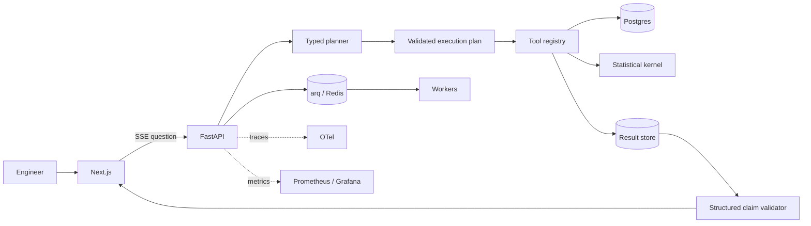

# Architecture

## System boundary

HRIA answers analytical questions about a versioned, synthetic hardware qualification dataset. The planner may select tools and fill typed arguments. It cannot execute arbitrary SQL, inspect unrestricted rows, or calculate result values. Statistical tools own the estimand, query, exclusions, method, uncertainty, and abstention rules.

The UI displays operational events—plan creation, tool start, tool completion, claim validation—not private chain-of-thought.

## Trust boundaries

1. Inputs are accepted only through Pydantic schemas.
2. A plan may name only registered tools.
3. Each tool owns parameterized SQL and pure statistical functions.
4. Tools return `success`, `insufficient_data`, `invalid_data`, or `execution_failure`.
5. Numerical claims include a result ID, JSON path, raw value, display transform, and unit.
6. Evidence paths are resolved and validated before prose is returned.
7. A numeral scanner is a secondary check, not the main grounding mechanism.
8. If grounding fails, the API returns structured results without unverified prose.

## Workload execution

Interactive queries run synchronously for streaming. Long-running evaluation or batch work is placed on arq. arq stores scheduled jobs in a Redis sorted set, so workers export `hria_arq_ready_jobs` using `ZCOUNT queue -inf now`; KEDA scales from that Prometheus metric. Deferred jobs are not counted as ready.

## Deployment

Terraform creates the VPC, private subnets, EKS, RDS PostgreSQL, ElastiCache Redis, ECR, Secrets Manager entry, and IRSA role. The backend is bootstrapped separately into a versioned S3 bucket and uses the native S3 lockfile.

The Helm chart installs API and worker Deployments, a migration Job, service account, PodDisruptionBudget, KEDA ScaledObject, probes, resources, and optional per-engineer namespace controls.
